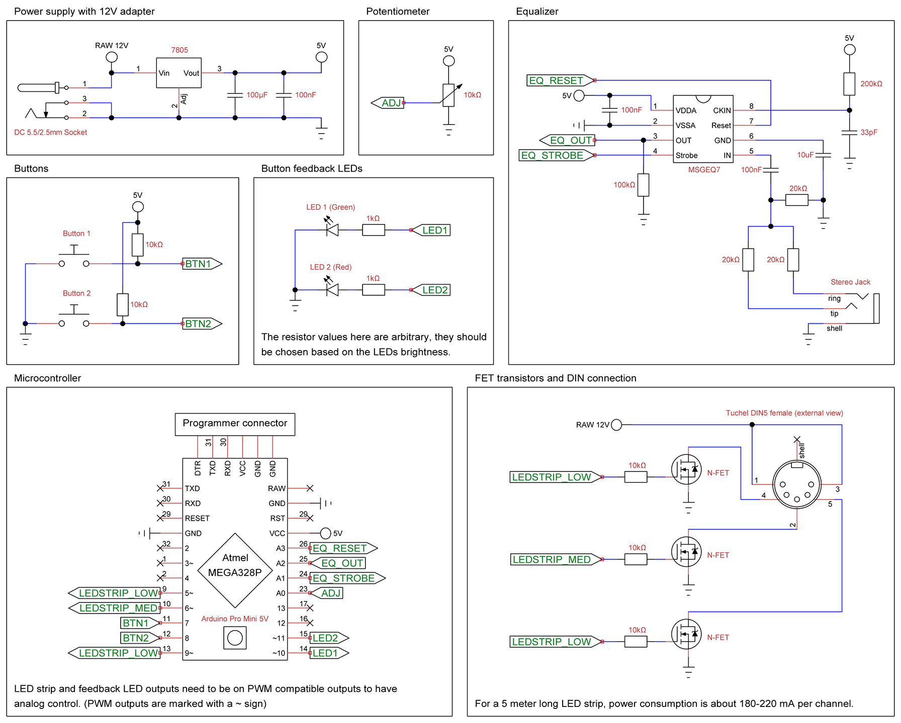

# LED Strip Controller with Arduino
The controller can drive an RGB LED strip which can be up to 25 meters long, using music as input. This can come from any device with a line level output (basically all PCs, mobile phones and Hi-Fi systems). It uses a visual equalizer which separates the audio into 3 channels: low, middle and high frequency, and each of these correspond to a specific color. The device also supports passive modes where no input is needed.

The full article is [available here](https://vbstudio.hu/blog/20250322-LED-Strip-Controller-with-Arduino).

## Schematics
The controller was designed to work with the 12V adapter that usually comes with these LED strips. The type of the DC connector was also picked to match that, although it might be different for other brands. The controller itself can handle a maximum of 36W (3A), however, the adapter might be limited to less than that. Considering a power use of 120mA per meter, the controller can theoretically drive a 25 meters long LED strip.

For the heart of the controller, I'm using an **Arduino Pro Mini** microcontroller. You can also use a Pro Micro or Uno, both of which has onboard USB connector for programming.

To preprocess the audio signal into something the microcontroller can work with, I'm using a dedicated chip, the **MSGEQ7 Seven Band Graphic Equalizer**. On its input side, two 20kΩ resistors are used to merge the audio channels from stereo to mono. These large values prevent any audible "monofication" of the sound when you plug the controller in parallel with your speakers. On the output, it generates 7 analog signals that correspond to different frequency bands on the input, which is then digitized and further processed by the microcontroller.

## How to install code
- Download and install the [Arduino IDE](https://www.arduino.cc/en/software).
- The Arduino IDE by default stores all Sketches in a folder named **"Arduino"** in your **Documents** folder.
- Download the repository and copy the entire **"LED_Strip_Controller"** folder to there.
- Start the Arduino IDE and select **"File"**, **"Sketches"**, and then choose **"LED_Strip_Controller"** from the list.

## Usage Manual
In case you want to use the code as is, here's a detailed manual on how it works, from a user perspective.

The interface contains 2 buttons with a feedback LED for each, and a potentiometer for some manual tuning. There are a total of 7 preset programs in the code, 3 active and 4 passive. Active programs rely on the audio input, while passive ones work without it. When a program is selected, the corresponding LED will be lit, mimicking slow breathing, while flashing several times according to the current program index. So, for the first program there's no flashing, for the second one it flashes once, then twice for the third and so on. Basically, the index starts from zero.

### Active program A0: Equalizer
This is the main / default mode. It breaks the input sound to 3 channels, where red is the low, green is the middle, and blue is the high frequency. The potentiometer is used for tweaking the buffer size, larger buffer means slower reaction time, filtering out noise.

### Active Program A1: Beat Detection
Changes the LED strip color on every beat. The color is picked from a preset list of vivid colors. Brightness is constant, regardless of input, so there is light even when there is no input.

### Active Program A2: Sound Detection
This one assumes a general silence and looks for sound spikes. When that occurs, the LED strip will lit up for a second and then slowly fade away. The trigger sensitivity can be adjusted using the potentiometer, while the color can be toggled with the red button while holding down the green button.

### Passive Program P0: All Colors
This one slowly sweeps through all colors in 1 minute.

### Passive Program P1: Red-blue Flashers
Flashes red and blue lights like on a police car.

### Passive Program P2: Adjustable Flashing

Flashing one color in a sine wave. The speed can be set with the potentiometer (to a maximum of half minute cycle), while the color is toggled with the green button while holding down the red button.

### Passive Program P3: Adjustable Constant Color
The color can be set with the potentiometer. The color range is as follows:

### Saving Default Program
You can save the currently selected program as default, as well as the color settings for A2 and P2 programs. To do this, press and hold any of the buttons for 4 seconds. When saving is done, both LEDs will flash 4 times.

### Standby Mode
If you only want to turn off the LED strip for a short time, you can put the device into stand-by mode by pressing both buttons simultaneously for 1.5 seconds. Both LEDs will flash twice when stand-by mode is started. To wake the device up, just press any of the buttons.

## License
MIT